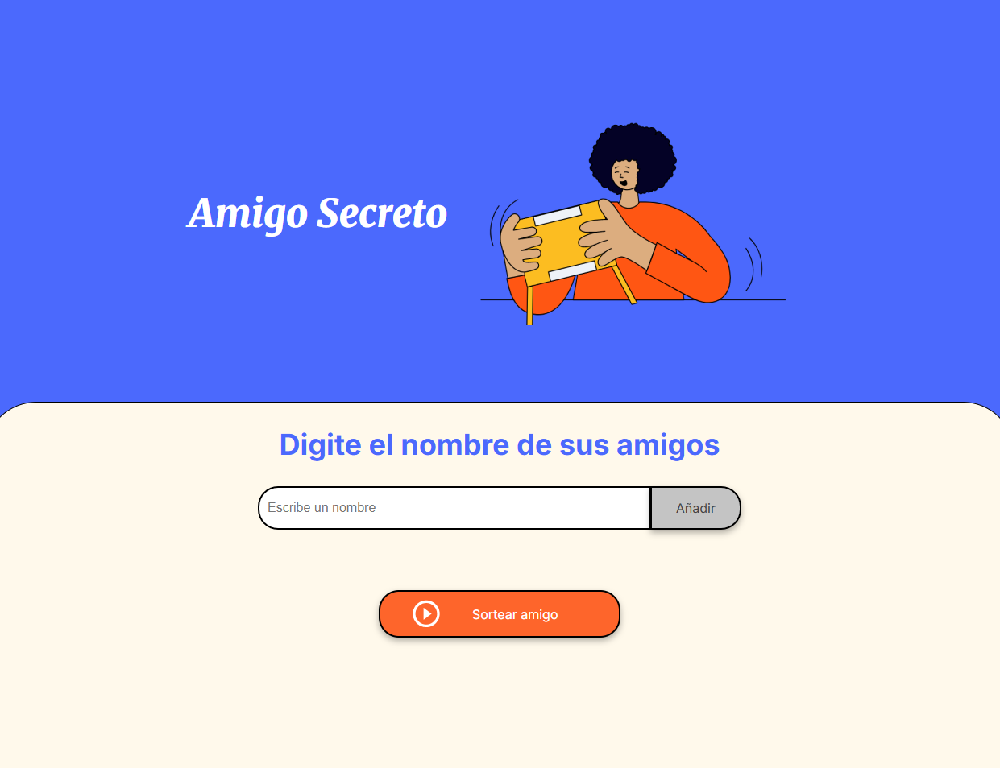

# 🎁 Amigo Secreto

Este es un proyecto web desarrollado con **HTML**, **CSS** y **JavaScript**, que permite registrar nombres de amigos y realizar un sorteo aleatorio para seleccionar un "amigo secreto".

##  Funcionalidades

-  Agregar nombres de amigos a una lista.
-  Validar que el nombre no esté vacío ni contenga números.
-  Visualizar en pantalla los nombres añadidos.
-  Sortear aleatoriamente un amigo de la lista.
-  Validación para que haya al menos dos personas antes de sortear.

##  Tecnologías utilizadas

- HTML5
- CSS3
- JavaScript 

##  Vista previa

##  Cómo usarlo

1. Escribe el nombre de un amigo y haz clic en "Añadir".
2. Repite hasta tener al menos dos nombres en la lista.
3. Haz clic en **"Sortear amigo"** para mostrar al amigo secreto.
4. Eso seria todo 😸
